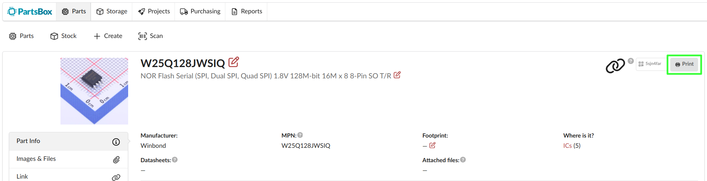
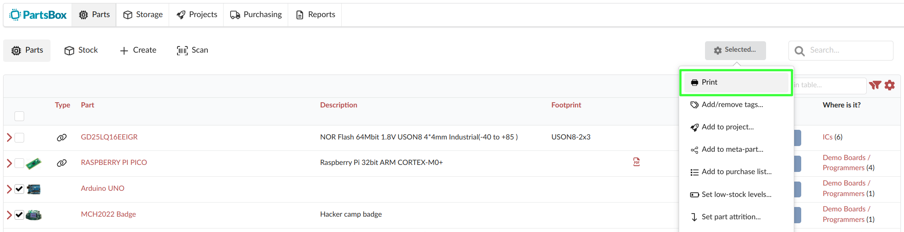

# Printing extension
This WebExtension allows you to easily get labels from your label printer
straight from your browser with a single click.

## Architecture
This project is made of two parts:
- A WebExtension that sends data to the daemon, and adds two buttons to the
  [PartsBox](https://partsbox.com) website interface:
	- One on a part/storage location page to print a single label
		
	- One on the list of parts to print labels for multiple parts in batch
		

- A daemon that listens for requests from the extension, generates the labels
  from a template with `glabels-3-batch`, and sends them to the label printer
  with `lpr`.

## Requirements
### Software
- [lprint](https://www.msweet.org/lprint/lprint.html)
- CUPS
- [gLabels](https://help.gnome.org/users/glabels/stable/)
	- Eurostile LT Std font - or change the template
- Python 3
	- requests (`pip install requests`)
- Chrome


### Hardware
You can probably use any label printer or label that is supported by lprint,
but some [customization](https://github.com/michaelrsweet/lprint/pull/152)
might be needed.

- DYMO LabelWriter 400/450
- DYMO 99015 diskette labels: they are the right size to fit my ziplock bags,
and have enough space for a QR code and some text.
- Ziplocks (ESD safe). Common sizes we use are:
	- 9x13 cm
	- 12x16 cm
	- 13x18 cm

## Compatibility
This was developed on Linux. The extension and most of the daemon should work
on Windows and MacOS, but the printing part will need to be adapted: `glabels`
is available on all platforms, but `lpr` is not.

The extension only works on **Chrome**, so far.

## Installation
### Extension
Go to the
[Chrome web store](https://chrome.google.com/webstore/detail/kdgkmaimjhjphiecnoneiecdgpddhdbp)
and install the extension, or clone this repository and load the unpacked
extension in Chrome (enable developer mode in `chrome://extensions`).

### Configure lprint
```bash
$ lprint devices # List available devices
$ lprint drivers # List all supported printers
$ lprint add -d <LPRINT_PRINTER_NAME> -v "<URI_FROM_devices>" -m <DRIVER_NAME>
$ sudo systemctl enable --now lprint.service
$ xdg-open http://localhost:8000 # Configure the printer
```

Now **navigate** to `http://localhost:8000` (or the port you see in
`systemctl status lprint`), and configure your printer there: set print media,
printer defaults, print a test page, etc.

### Configure CUPS
**NOTE**: Don't configure the printer in CUPS, as it will not change the
actual printer settings. Use the lprint web interface instead.
```bash
$ lpadmin -p <CUPS_PRINTER_NAME> -v ipp://localhost:8000/ipp/print/<LPRINT_PRINTER_NAME> -m everywhere
```
Now the printer is available to all applications that use CUPS.

### Daemon
Copy the service to your home directory, edit the **paths** and add the API key to
the service file.
```bash
$ cp partsbox_print_daemon.service ~/.config/systemd/user/
$ systemctl --user edit partsbox_print_daemon.service --full	# Change the paths to the daemon accordingly
```

Now add the **environment variables** to the service file and enable it.
```bash
$ systemctl --user edit partsbox_print_daemon.service
```

Add the following to the file:
```ini
[Service]
Environment="PARTSBOX_API_KEY=<SECRET_API_KEY>"
```
*You can retrieve the API key from the PartsBox website by going to Settings ->
Data -> API.*

And finally, **enable and start** the service.
```bash
$ systemctl --user enable --now partsbox_print_daemon.service
```

## Usage
Navigate to the [PartsBox](https://partsbox.com) website, and you should see
the two buttons on the pages mentioned above. Clicking them will send a request
to the daemon, which will fetch data from the PartsBox API, generate the label
and send it to the printer.

If you want to play around with the daemon you can use the `--dry-run` flag to
generate the label and display it in your default pdf viewer.

```bash
$ export PARTSBOX_API_KEY=<SECRET_API_KEY>
$ python3 partsbox_print_daemon.py --dry-run
```

## TODO
- [ ] Port extension to Firefox
- [ ] Publish on Chrome/Firefox store
- [ ] Add systemctl service for the daemon
